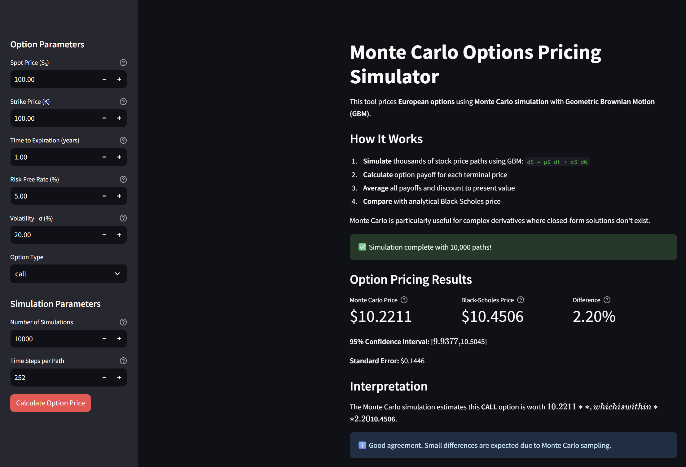
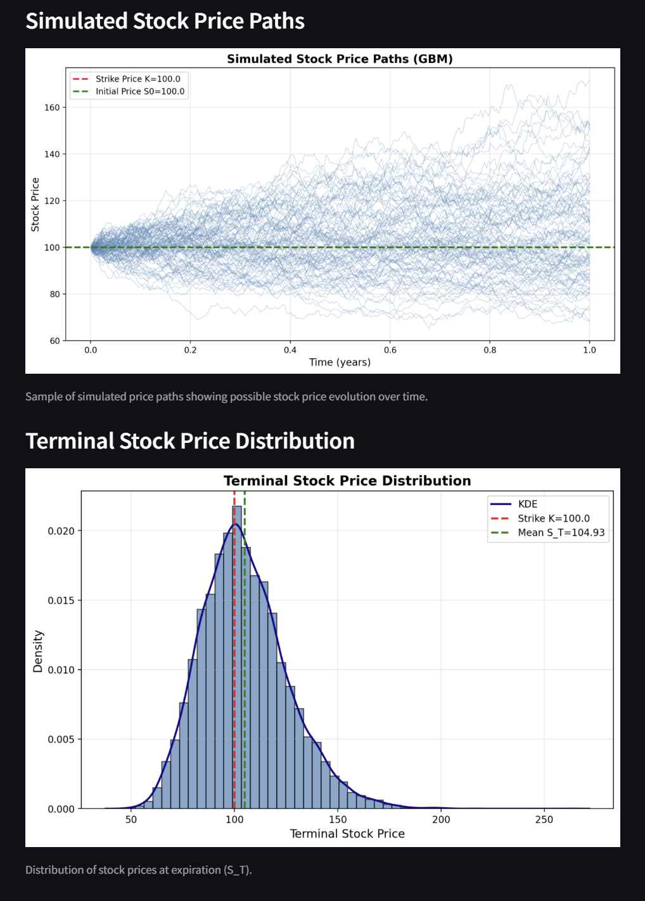
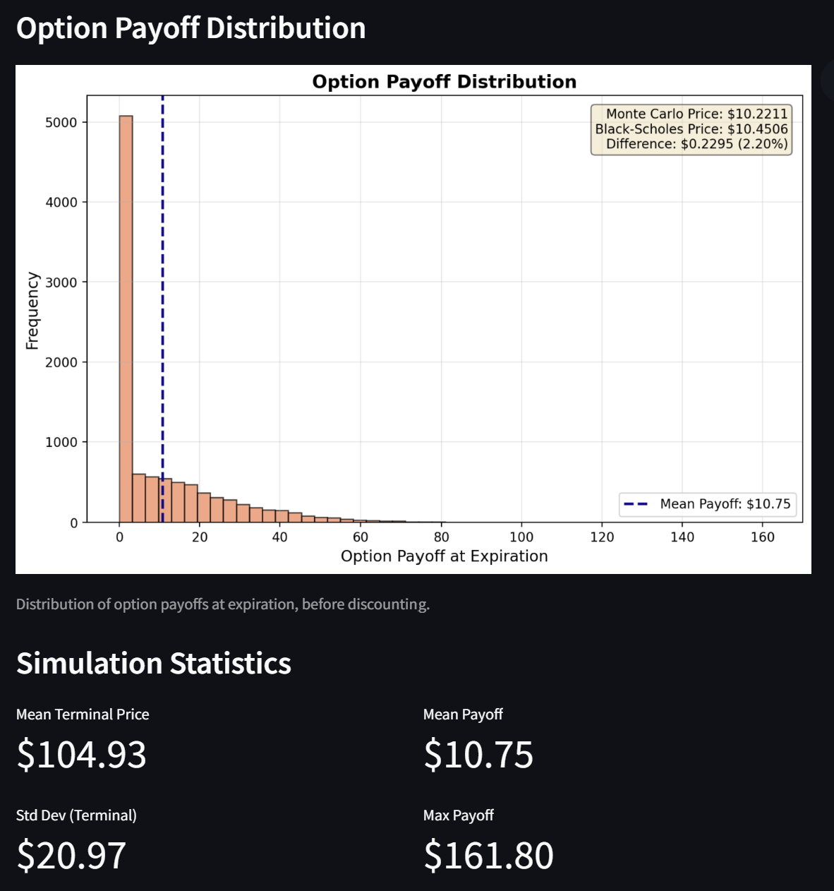

## Monte Carlo Options Pricing Simulator

> **Part of 5-Project Quantitative Finance Portfolio Series**
> 
> **Week 3 of 5** | [View All Projects](#project-series)

Professional **Monte Carlo simulation** tool for pricing European options using **Geometric Brownian Motion (GBM)**. Validates results against the **Black-Scholes analytical formula**.

### Key Features

- **Geometric Brownian Motion**: Simulate realistic stock price paths
- **Monte Carlo Pricing**: Price options by averaging thousands of simulated outcomes
- **Black-Scholes Comparison**: Benchmark Monte Carlo estimates against theoretical prices
- **Full Visualization Suite**: View simulated paths, payoff distributions, and terminal prices
- **Statistical Analysis**: Confidence intervals, standard errors, convergence metrics
- **Both CLI & UI**: Command-line tool and interactive Streamlit dashboard

---

## What is Monte Carlo Simulation?

**Monte Carlo simulation** is a numerical technique that uses random sampling to estimate the probability distribution of an outcome. In options pricing:

1. **Simulate** thousands of possible future stock price paths using a stochastic model (GBM)
2. **Calculate** the option payoff for each simulated terminal price
3. **Average** all payoffs to get the expected payoff
4. **Discount** the expected payoff to present value

According to [Investopedia](https://www.investopedia.com/terms/m/montecarlosimulation.asp), Monte Carlo simulations are widely used in finance for pricing derivatives, assessing portfolio risk, and modeling scenarios where randomness plays a key role.

### Geometric Brownian Motion (GBM)

GBM models stock price evolution as:

```
dS = μS dt + σS dW
```

Where:
- `S` = stock price
- `μ` = drift (expected return, use risk-free rate for risk-neutral pricing)
- `σ` = volatility (annualized standard deviation)
- `dW` = Wiener process (random component)

The exact solution is:

```
S(t) = S(0) * exp((μ - 0.5σ²)t + σ√t * Z)
```

Where `Z ~ N(0,1)` is a standard normal random variable.

---

## 1. Setup

From the project root (`monte-carlo-sim-options-quant`):

```bash
python -m venv .venv
# On PowerShell
.venv\Scripts\Activate.ps1

pip install -r requirements.txt
```

---

## 2. CLI Usage

Price options from the command line:

```bash
python main_cli.py --spot-price 100 --strike-price 100 --time-to-expiration 1.0 --risk-free-rate 0.05 --volatility 0.20 --option-type call --num-simulations 10000
```

### Parameters

- **`--spot-price`**: Current stock price S₀ (default: 100.0)
- **`--strike-price`**: Strike price K (default: 100.0)
- **`--time-to-expiration`**: Time to expiration in years (default: 1.0)
- **`--risk-free-rate`**: Risk-free rate as decimal (default: 0.05)
- **`--volatility`**: Annualized volatility as decimal (default: 0.20)
- **`--option-type`**: `call` or `put` (default: call)
- **`--num-simulations`**: Number of Monte Carlo paths (default: 10000)
- **`--num-steps`**: Time steps per path (default: 252)

### Example Output

```text
============================================================
Monte Carlo Options Pricing Results
============================================================

Option Parameters:
  Type:                  CALL
  Spot Price (S0):       $100.00
  Strike Price (K):      $100.00
  Time to Expiration:    1.00 years
  Risk-Free Rate:        5.00%
  Volatility (σ):        20.00%

Simulation Parameters:
  Number of Simulations: 10,000

Monte Carlo Results:
  Estimated Price:       $10.4521
  Standard Error:        $0.1234
  95% Confidence Interval: [$10.2103, $10.6939]

Black-Scholes Results:
  Theoretical Price:     $10.4506

Comparison:
  Absolute Difference:   $0.0015
  Percentage Difference: 0.01%

Interpretation:
  The Monte Carlo simulation estimates the call option price
  at $10.4521, which differs from the Black-Scholes theoretical
  price by 0.01%. This difference is due to Monte Carlo sampling
  error and typically decreases with more simulations.

============================================================
```

### CLI Screenshot


The CLI displays complete Monte Carlo pricing results including option parameters, simulation settings, estimated price with confidence interval, Black-Scholes benchmark, and a detailed comparison with interpretation.

---

## 3. Streamlit UI

Launch the interactive web interface:

```bash
streamlit run app_streamlit.py
```

### Features

Configure in the sidebar:
- **Option parameters**: Spot price, strike, expiration, rate, volatility, type
- **Simulation settings**: Number of paths, time steps

The app displays:
- **Price comparison**: Monte Carlo vs Black-Scholes with confidence interval
- **Simulated price paths**: Visualization of stock price evolution
- **Terminal price distribution**: Histogram and KDE of final prices
- **Payoff distribution**: Option payoffs across all simulations
- **Statistics**: Mean, std dev, max payoff, etc.

### UI Screenshots

**Main Dashboard with Pricing Results**



Configure option parameters and simulation settings in the sidebar, then view the Monte Carlo estimated price compared with Black-Scholes, including confidence intervals and interpretation.

**Simulated Price Paths and Terminal Distribution**



Visualize 100 simulated stock price paths showing how prices evolve under GBM (top), and view the distribution of terminal stock prices at expiration with strike price and mean overlaid (bottom).

**Payoff Distribution and Statistics**



View the histogram of option payoffs across all simulations with pricing comparison details (top), and examine key simulation statistics including mean terminal price, payoff metrics, and standard deviations (bottom).

---

## 4. Project Structure

```text
monte-carlo-sim-options-quant/
├─ requirements.txt        # Python dependencies
├─ README.md               # This file
├─ images/                 # App screenshots
├─ src/
│  ├─ __init__.py          # Package init
│  ├─ config.py            # Default configuration
│  ├─ market_data.py       # Fetch real market data (optional)
│  ├─ gbm.py               # Geometric Brownian Motion simulator
│  ├─ options.py           # Option payoff calculations
│  ├─ black_scholes.py     # Analytical Black-Scholes pricing
│  ├─ monte_carlo.py       # Monte Carlo pricing engine
│  ├─ visualizations.py    # Plotting utilities
│  └─ pipeline.py          # End-to-end pricing pipeline
├─ main_cli.py             # CLI entry point
└─ app_streamlit.py        # Streamlit UI
```

---

## 5. Theory: Monte Carlo vs Black-Scholes

### Black-Scholes Formula

For a European **call** option:

```
C = S₀ * N(d₁) - K * e^(-rT) * N(d₂)

d₁ = [ln(S₀/K) + (r + σ²/2)T] / (σ√T)
d₂ = d₁ - σ√T
```

For a European **put** option:

```
P = K * e^(-rT) * N(-d₂) - S₀ * N(-d₁)
```

Where `N(·)` is the cumulative standard normal distribution.

### Monte Carlo Method

1. **Simulate** N price paths using GBM:
   ```
   S_T^(i) = S₀ * exp((r - 0.5σ²)T + σ√T * Z^(i))
   ```
   where `Z^(i) ~ N(0,1)`

2. **Calculate** payoff for each path:
   - Call: `max(S_T^(i) - K, 0)`
   - Put: `max(K - S_T^(i), 0)`

3. **Average** payoffs:
   ```
   V̂ = (1/N) * Σ payoff^(i)
   ```

4. **Discount** to present value:
   ```
   Option Price = e^(-rT) * V̂
   ```

### Convergence

Monte Carlo error decreases at rate **1/√N**. To halve the error, you need **4x more simulations**.

**Standard Error:**
```
SE = σ_payoff / √N
```

**95% Confidence Interval:**
```
[Price - 1.96*SE, Price + 1.96*SE]
```

---

## 6. Why Use Monte Carlo?

### Advantages
- **Flexibility**: Can price complex, path-dependent, or exotic options
- **No closed-form needed**: Works when analytical solutions don't exist
- **Easy to implement**: Straightforward algorithm
- **Confidence intervals**: Provides error estimates

### Disadvantages
- **Computational cost**: Requires many simulations for accuracy
- **Slow convergence**: Error ∝ 1/√N
- **Not suitable for early exercise**: Standard Monte Carlo is for European options

### When to Use
- **Complex payoffs**: Barriers, lookbacks, Asians, baskets
- **Multiple underlyings**: Multi-asset options
- **Path dependence**: When payoff depends on price history
- **Verification**: Validate pricing models and check Greeks

---

## 7. Use Cases & Extensions

### Key Concepts Demonstrated
This project demonstrates:
- Understanding of **stochastic processes** (GBM)
- **Numerical methods** in finance (Monte Carlo)
- **Analytical solutions** (Black-Scholes)
- **Risk-neutral pricing** theory
- **Statistical analysis** and error estimation
- Production-quality Python implementation

### Potential Extensions
- **American options**: Early exercise using Longstaff-Schwartz regression
- **Variance reduction**: Antithetic variates, control variates, importance sampling
- **Path-dependent options**: Asian, barrier, lookback options
- **Greeks calculation**: Delta, gamma, vega via finite differences or pathwise method
- **Jump diffusion**: Merton jump-diffusion model
- **Stochastic volatility**: Heston model
- **Multi-asset options**: Correlation and basket options

---

## 8. Mathematical Background

### Risk-Neutral Pricing

In a risk-neutral world:
- Expected return on all assets equals the risk-free rate
- Option prices are expected discounted payoffs
- No arbitrage opportunities exist

This allows us to:
1. Use `r` (risk-free rate) as drift in GBM
2. Discount at `r` to get present value
3. Price independent of investor risk preferences

### Log-Normal Distribution

Under GBM, stock prices at time T are **log-normally distributed**:

```
S_T ~ LogNormal(μ, σ²)

where:
  E[S_T] = S₀ * e^(rT)
  Var[ln(S_T/S₀)] = σ²T
```

This ensures prices remain positive and matches empirical data reasonably well for short horizons.

---

## 9. References & Further Reading

- [Investopedia: Monte Carlo Simulation](https://www.investopedia.com/terms/m/montecarlosimulation.asp) - Overview and applications
- [Black-Scholes Model - Investopedia](https://www.investopedia.com/terms/b/blackscholes.asp)
- [Options, Futures, and Other Derivatives - John Hull](https://www.amazon.com/Options-Futures-Other-Derivatives-10th/dp/013447208X) - Chapters 13-15, 21
- [Monte Carlo Methods in Financial Engineering - Paul Glasserman](https://www.springer.com/gp/book/9780387004518) - Comprehensive technical reference
- [Longstaff-Schwartz Method](https://people.math.ethz.ch/~hjfurrer/teaching/LongstaffSchwartzAmericanOptionsLeastSquareMonteCarlo.pdf) - American options via Monte Carlo

---

## Project Series

This project is **Week 3** of a 5-project quantitative finance portfolio series:

1. **Week 1: Stock Price Prediction with Linear Regression**  
   [https://github.com/shaoyangchin/linear-reg-quant](https://github.com/shaoyangchin/linear-reg-quant)

2. **Week 2: Value at Risk (VaR) Calculator**  
   [https://github.com/shaoyangchin/var-calc-quant](https://github.com/shaoyangchin/var-calc-quant)

3. **Week 3: Monte Carlo Options Pricing Simulator** (This Project)  
   [https://github.com/shaoyangchin/monte-carlo-sim-options-quant](https://github.com/shaoyangchin/monte-carlo-sim-options-quant)

4. **Week 4: Pairs Trading Strategy Backtest**  
   [https://github.com/shaoyangchin/pair-trade-strat-quant](https://github.com/shaoyangchin/pair-trade-strat-quant)

5. **Week 5: Portfolio Optimization Tool**  
   [https://github.com/shaoyangchin/portfolio-optimization-tool-quant](https://github.com/shaoyangchin/portfolio-optimization-tool-quant)

---
